<picture>
  <source media="(prefers-color-scheme: dark)" srcset="assets/header-dark.svg">
  <source media="(prefers-color-scheme: light)" srcset="assets/header-light.svg">
  
</picture>

<picture>
  <source media="(prefers-color-scheme: dark)" srcset="assets/stats-dark.svg">
  <source media="(prefers-color-scheme: light)" srcset="assets/stats-light.svg">
  
</picture>

  <picture>
    <source media="(prefers-color-scheme: dark)" srcset="assets/languages-dark.svg">
    <source media="(prefers-color-scheme: light)" srcset="assets/languages-light.svg">
    
  </picture>
  <picture>
    <source media="(prefers-color-scheme: dark)" srcset="assets/activity-dark.svg">
    <source media="(prefers-color-scheme: light)" srcset="assets/activity-light.svg">
    
  </picture>

<picture>
  <source media="(prefers-color-scheme: dark)" srcset="assets/calendar-dark.svg">
  <source media="(prefers-color-scheme: light)" srcset="assets/calendar-light.svg">
  
</picture>

  
  
  

<!--
Cards are hand-rolled SVGs (scripts/build_header.py + scripts/build_cards.py),
regenerated every 6 hours by .github/workflows/metrics.yml.
-->
